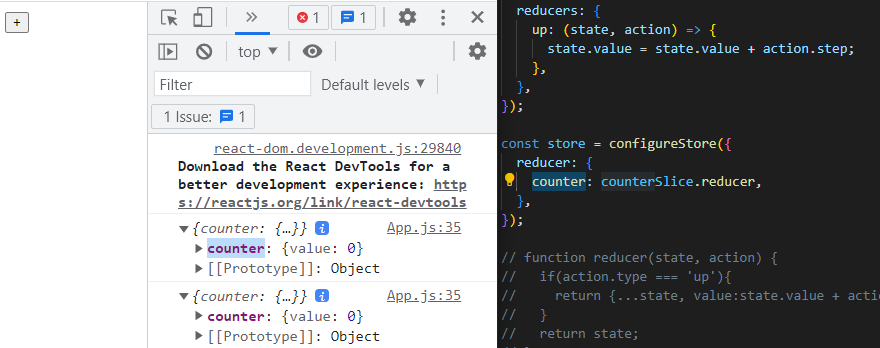
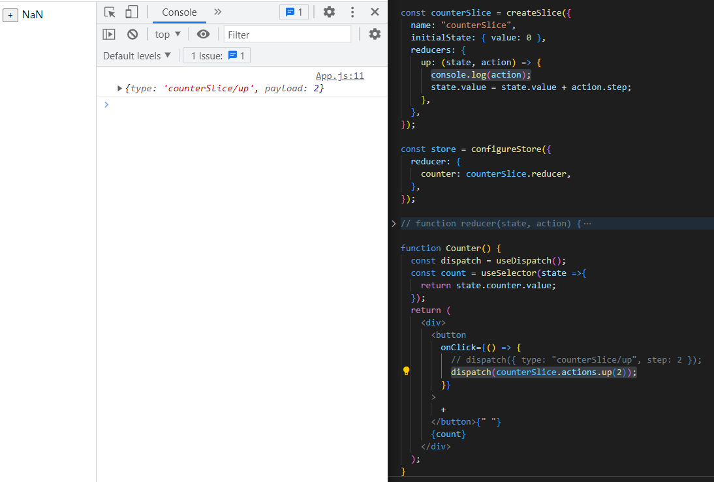

# Redux Toolkit

생활코딩 Redux toolkit 영상을 보면서 정리
https://youtu.be/9wrHxqI6zuM

<br/>


➡️ console에 찍히는 `counter`가 코드에서 가리키는 부분

<br/>


➡️console창에 payload가 2인 모습을 볼 수 있으므로
```jsx
    up: (state, action) => {
      console.log(action);
      state.value = state.value + action.step;
    },
```
여기서 `action.step`을 `action.payload`로 바꿔준다.