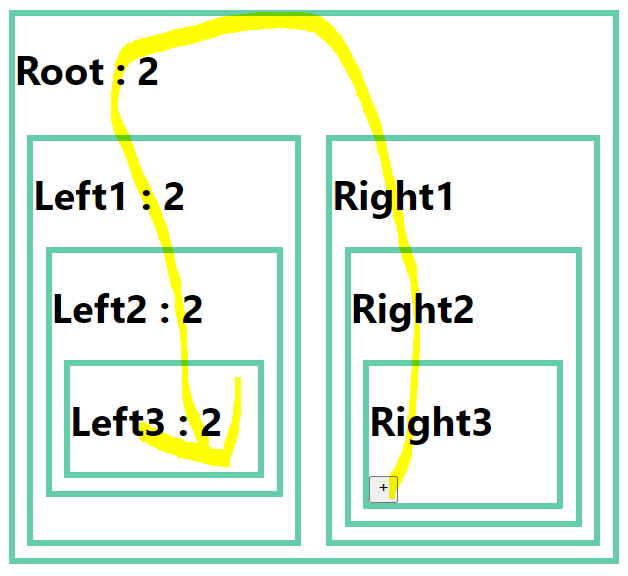

### Redux

> 생활코딩 https://youtu.be/yjuwpf7VH74 보고 정리


```jsx
export default function App() {
  const [number, setNumber] = useState(1);

  return (
    <div id="container">
      <h1>Root</h1>
      <Left1 number={number}></Left1>
    </div>
  );
}

function Left1(props) {
  return (
    <div>
      <h1>Left1 : {props.number}</h1>
      <Left2 number={props.number} ></Left2>
    </div>
  );
}

function Left2(props) {
  return (
    <div>
      <h1>Left2 : {props.number}</h1>
      <Left3 number={props.number}></Left3>
    </div>
  );
}

function Left3(props) {
  return (
    <div>
      <h1>Left3 : {props.number}</h1>
    </div>
  );
}
```
최상위에 있는 `number`를 Left3에 전달해주기 위해 Left1, Left2에서 사용하지 않음에도 불구하고 Left3을 위해 내려주는 불필요한 코드를 작성




Left3: 1의 값을 바꾸기 위해 Right3 -> 2 -> 1-> Root -> left1 -> 2 -> 3 을 거쳐야만 한다.

Right3과 Left3을 무선으로 연결시켜주는 것이 **Redux**