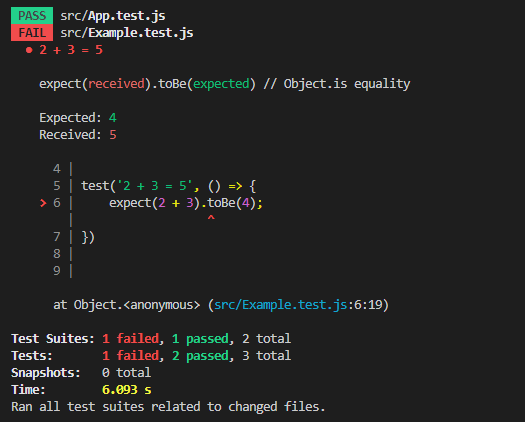

# TDD with React

```json
  "dependencies": {
    "@testing-library/jest-dom": "^5.16.5",
    "@testing-library/react": "^13.4.0",
    "@testing-library/user-event": "^13.5.0",
    "react": "^18.2.0",
    "react-dom": "^18.2.0",
    "react-scripts": "5.0.1",
    "web-vitals": "^2.1.4"
  },
  "scripts": {
    "start": "react-scripts start",
    "build": "react-scripts build",
    "test": "react-scripts test",
    "eject": "react-scripts eject"
  },
```

`@testing-library/jest-dom` : Jest-dom 제공하는 custom matcher를 사용할 수 있게 해준다.

`@testing-library/react` : 컴포넌트의 요소를 찾기 위한 query가 포함되어 있다.

`@testing-library/user-event` : click 등 사용자 이벤트에 이용된다.

<br>

```jsx
// src/App.test.js
import { render, screen } from "@testing-library/react";
import App from "./App";

test("renders learn react link", () => {
  render(<App />);
  const linkElement = screen.getByText(/learn react/i);
  expect(linkElement).toBeInTheDocument();
});
```

테스트를 하기 위한 환경이 사전에 설치 되어 있는 것을 알 수 있다.

`test` 함수는 `Jest` 함수로 테스트를 실행할 때 반드시 이용하는 함수이다. `test` 함수의 첫 번째 인자는 테스트가 어떤 내용인지 알 수 있도록 설명을 작성한다. 두 번째 인자는 하고자 하는 테스트를 함수의 형태로 넣는다.

<br>

### `npm run test`


`press a`


실행한 테스트에 성공했음을 의미하는 **PASS** 메시지를 확인 가능
테스트 건수나 테스트에 걸린 시간 등도 확인 가능

### `FAIL`



메시지를 읽어보면

````
    Expected: 4
    Received: 5
````
예상값과 받은 값이 달라서 `FAIL`이 뜬 것을 알 수 있다.